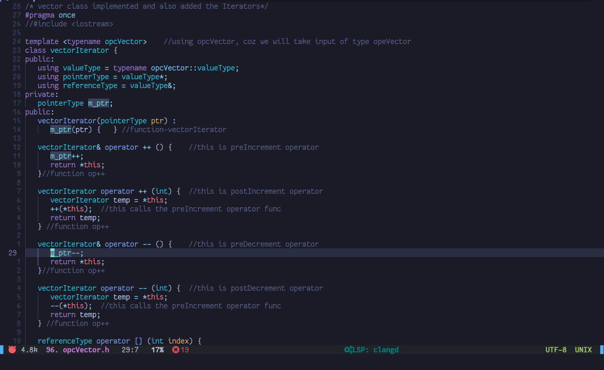
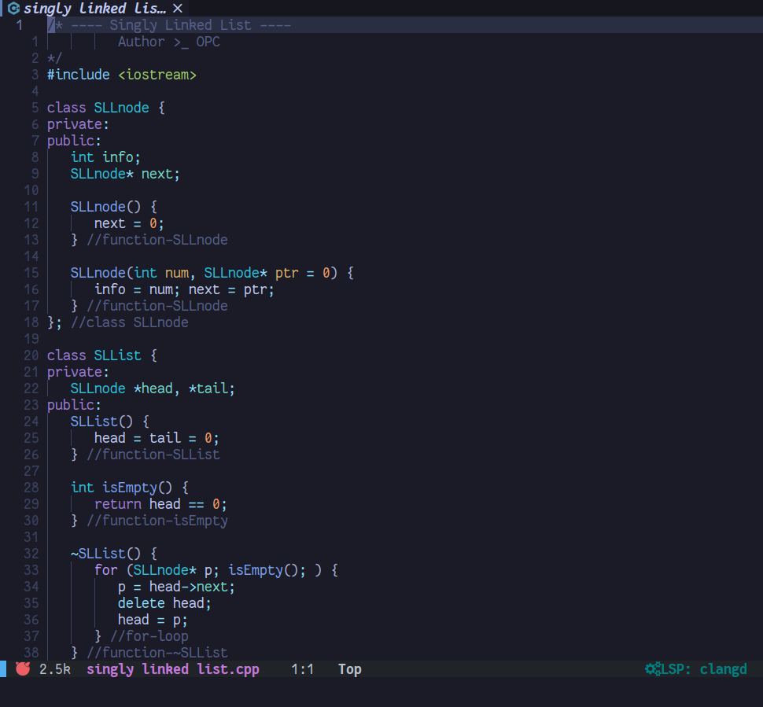

## CPP in deep

---

Here are few files related to concepts in [C++](https://en.wikipedia.org/wiki/C++) language.

Hope you learn something about the language and get good at programming :)

---

---
